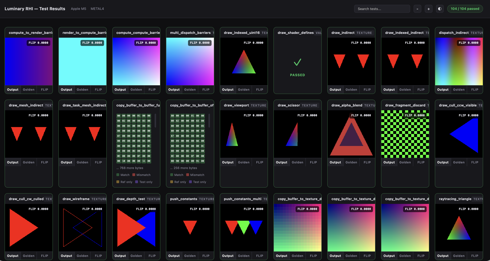
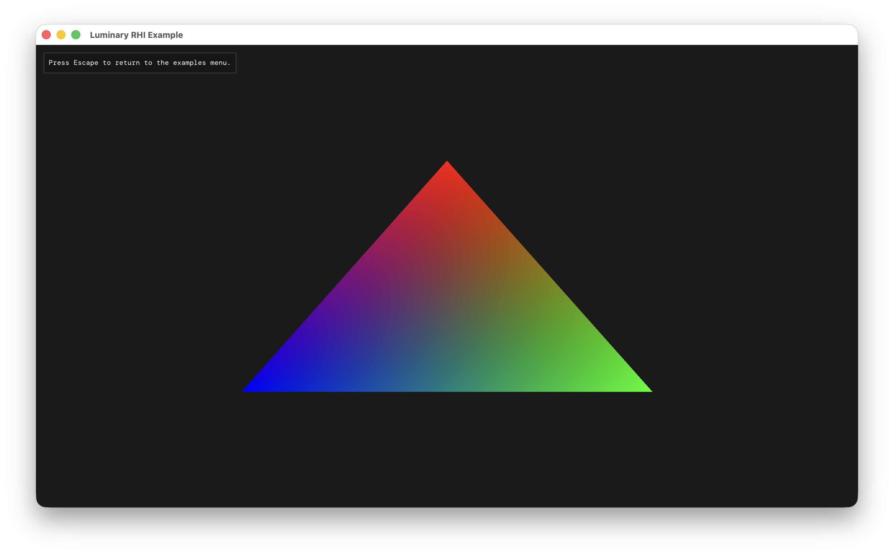
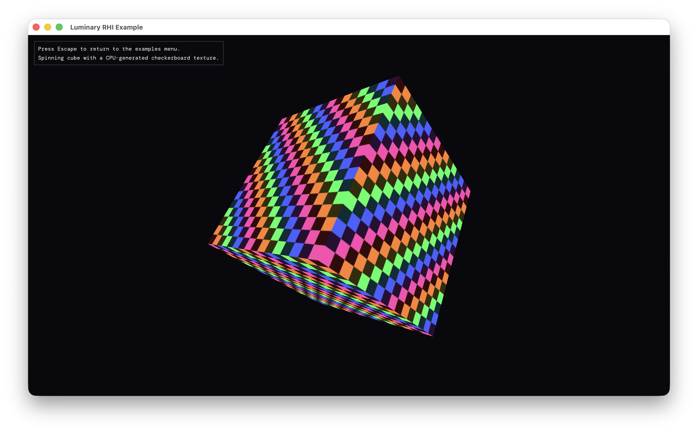
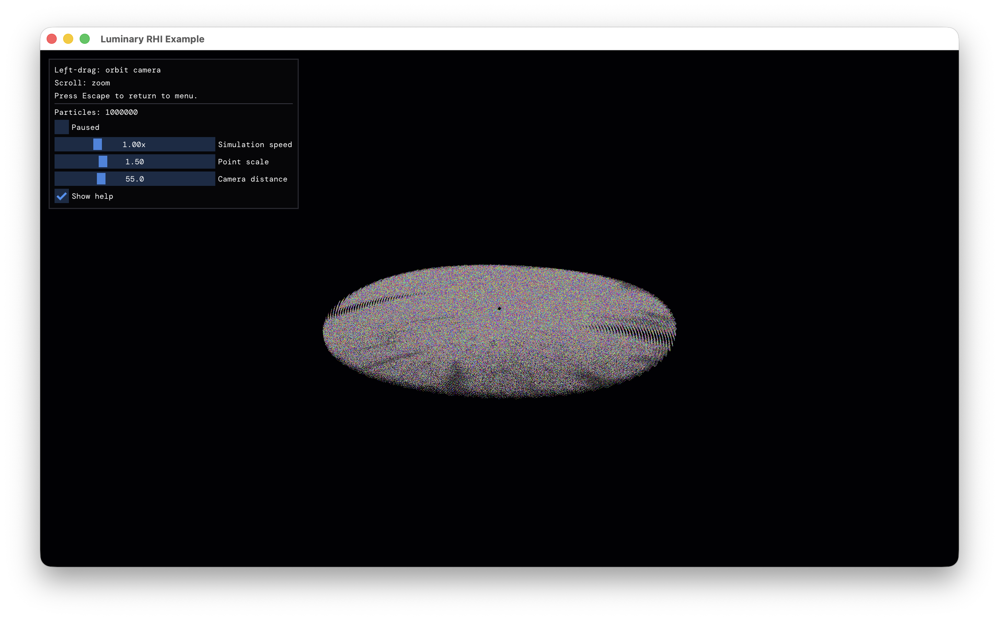
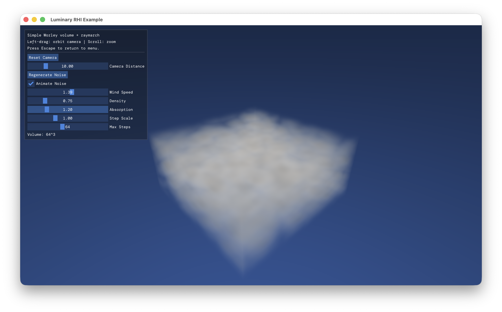

# Luminary RHI : cross-platform render hardware interface

Luminary RHI is a render hardware interface used by the prioprietary Luminary engine. It is written entirely in C. It's MIT licensed, you are free to use/modify/distribute it as you like in your project.

It is intended for modern day graphics, and thus forces a few things to work. Bindless is mandatory. Mesh shaders, raytracing and multi draw indirect can optionally be used. Concepts like barriers, synchronization, GPU residency, resource views are explicit.

This project is a *work in progress*.

## Status

- Metal 3 : stable
- Metal 4 : stable
- Vulkan : unimplemented
- D3D12 : unimplemented

## Requirements

- Metal 3 backend: Apple Silicon
- Metal 4 backend: macOS/iOS 26, Apple Silicon
- Vulkan backend: VK_EXT_descriptor_indexing, VK_EXT_mutable_descriptor_type, VK_KHR_unified_image_layouts
- D3D12 backend: Shader model 6.6

## How to build

Luminary RHI is very easy to add to your project. Depending on your targeted APIs, make sure to compile the following files in your project:
- luminary_rhi_internal.c
- luminary_rhi.c

And the backend you wish to target. The necessary libraries to link are as follows:
- Metal3/4: QuartzCore, Foundation, Metal, Cocoa
- D3D12: dxgi.lib

## Tests, examples, goodies

This project provides a few goodies and projects that showcases features from the RHI.
The tests allow you to easily check the validity of RHI features -- it covers a wide variety of edge cases. To run them, just do `xmake run tests`, and then see the results in your web browser by opening up an http server and tests/viewer.html.

The RHI is also provided with some goodies to help you bootstrap:
- [Shader compiler](extras/shader_compiler/luminary_shader_compiler.h)
- [ImGui backend](extras/imgui_backend/imgui_impl_luminary.h)
- [HLSL include for bindless and other utils](extras/shader_includes/LuminaryRHI.hlsli)

And finally, I implemented a few examples using the RHI and plan on adding a few more. For now, the examples include:\
Triangle

Cube

Compute particles

Pathtracer

Volumetric cloud

GLTF renderer

